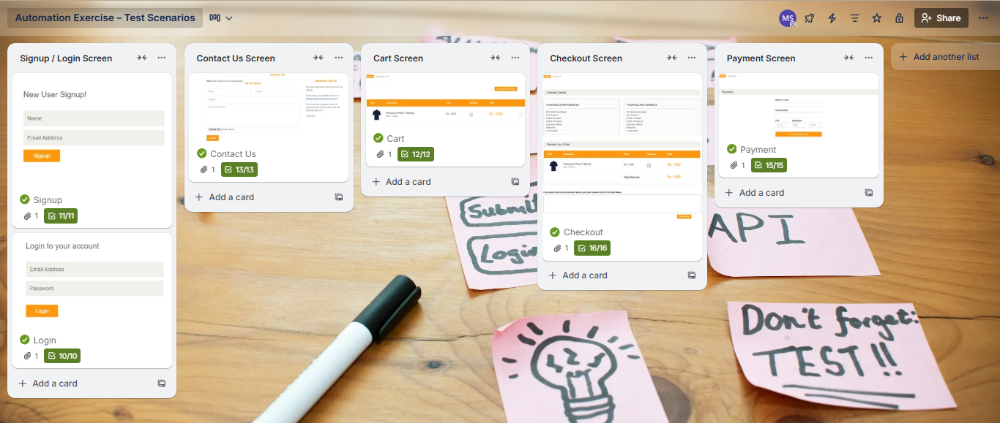

# Manual Testing Practice – Automation Exercise

This repository contains a **Manual Testing practice project** for the
Automation Exercise website.

##  Website Under Test:
Website Link: [https://automationexercise.com]

##  Project Goal
- Practice manual testing on a real e-commerce website
- Write valid and invalid test scenarios
- Understand real user flows

##  Covered Pages
- Signup / Login
- Contact Us
- Cart
- Checkout
- Payment

##  Tools Used
- Manual Testing
- Trello (test scenario organization & tracking)

##  Trello Board
View-only Trello board:
[https://trello.com/b/JdxpLAHW/automation-exercise-test-scenarios]

##  Board Screenshot

##  Project Status
Completed test scenarios  
More manual testing projects coming soon
